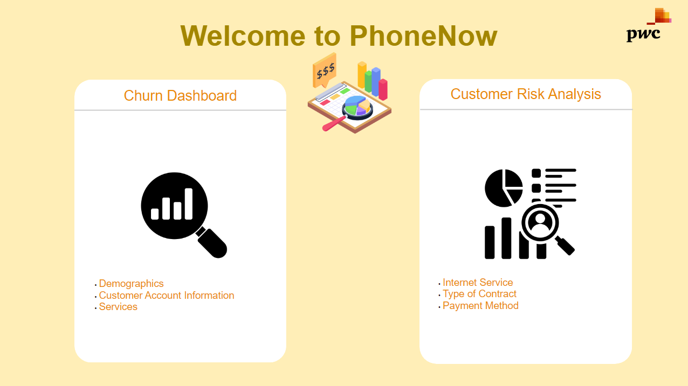

# Churn Dashboard & Customer Risk Dashboard
## Overview
This PowerBI report consists of two dashboards: the Churn Dashboard and the Customer Risk Dashboard. These dashboards were created as part of the PwC PowerBI virtual case experience for a telecom company. The Churn Dashboard focuses on analyzing customer churn, while the Customer Risk Dashboard is designed to identify customers at risk of churning.

## Churn Dashboard
The Churn Dashboard provides insights into customer churn based on the provided dataset. It includes visualizations and key metrics related to customer churn, such as reasons for churn, customer demographics, and more. The dashboard aims to help the telecom company understand and reduce customer churn.

## Customer Risk Dashboard
The Customer Risk Dashboard is designed to identify customers who are at risk of churning. It includes visualizations and metrics that help in predicting customer churn, such as customer behavior, usage patterns, and engagement metrics. The dashboard provides actionable insights to the retention department for proactive measures to retain customers.

## Usage
- Data Import: Import the provided dataset into PowerBI.
- Data Preparation: Clean and shape the data as per the instructions.
- Dashboard Creation: Use the provided DAX measures to create visualizations.
- Interactivity: Utilize slicers and filters for interactive analysis.
- Insights: Analyze the visualizations to gain insights into churn and customer risk.

# Credits
This report was created by Suraj Balraj as part of the PwC PowerBI virtual case experience.
